# 랜덤 디펜스

## Index
1. [랜덤 디펜스 개요](#랜덤-디펜스-개요) 
2. [컨셉](#메인-컨셉)
3. [이미지 & 동영상](#이미지--동영상)   
 1.[ 대표 이미지](#대표-이미지)  
 2.[ 관련 이미지 & 동영상](#관련-이미지--동영상)  
 3.[ 이미지 기반 작품묘사](#컨셉대표이미지-기반-작품묘사)  
4. [Random Defense 구성 요소](#랜덤-디펜스-구성-요소)  
5. [Game System Design](#Game-System-Disign)  
 1.[ 게임 오브젝트 분해](#1-게임-오브젝트-분해-구성-요소-분석)  
 2.[ 파라미터[속성] 뽑아보기](#2-파라미터속성-뽑아보기)  
 3.[ 행동양식](#3-행동양식)  
 4.[ 상태 뽑아 보기](#4-상태-뽑아-보기)  
 5.[ 플레이어 캐릭터 속성(파라미터)](#5-플레이어-캐릭터-속성파라미터)  
 6.[ 게임의 규칙](#6-게임의-규칙)  
 7.[ 게임에서 사용될 공식](#7-게임에서-사용될-공식)   
6. [개발 요구사항 & 흐름도](#개발-요구사항-및-흐름도)  
 1.[ 요구사항(6주)](#요구사항6Week)  
 2.[ 요구사항(1년)](#요구사항1Year)  
 3.[ FlowChart](#시간별-흐름도-flowchart)  
 4.[ 이벤트에 대한 흐름도](#마우스-이벤트에-대한-흐름도)  
 5.[ 용어 정리](#용어-정리)  
7. [개발작업 일정](#개발작업-일정)  

## 랜덤 디펜스 개요
---
- 랜덤으로 만들어지는 타워들을 조합하여 꾸준히 강해지는 적들로부터 오래 생존하는 것이 목표.
- 프로젝트 랜타디를 모티브로 제작하였음.
 

---

## 메인 컨셉
- 디펜스Defense : 방어. 적을 공격하는 타워들을 설치하여 지정된 길로 오는 적들을 막아내어 오랜 시간 버티는 것이 목표.
- 적들은 꾸준히 강해지며 플레이어는 한정된 자원을 효율적으로 사용하여야 한다
  

---
## 서브 컨셉
 

### 서브 컨셉1 : 운
- 플레이어의 운에 따라 플레이가 갈린다.
- 플레이어가 건설하는 타워는 원하는 위치에, 랜덤하게 건설되며(1티어 타워 – A, B, C Type중 하나) 타워들을 조합하여 나오는 타워 또한 랜덤한 타입으로 생성된다.
- 타워의 최대 티어(조합 단계)는 5레벨로 설정되며 그 또한 무엇이 나올지 모른다. 각각의 타워는 적의 타입에 따라 추가 데미지를 주거나 감소된 데미지로 공격한다.
- 예시로, A타입의 타워는 A타입의 적에게 추가 데미지를 주지만 B타입의 적에게는 감소된 데미지를 준다.

### 서브컨셉 2 : 한정된 자원
- 모든 플레이를 운에 맡기면 자칫 게임이 단조로워 질 수 있다.
- 플레이어는 적들을 처치하며 얻은 자원을 효율적으로 사용해야 한다.
- 웨이브 하나가 끝날 때마다 소량의 자원을 얻는다. 이것으로 타워를 건설할지, 아니면 타워의 업그레이드를 할 지 선택하여 게임을 풀어나갈 수 있다.

### 서브컨셉 3 : 도전심
- 이러한 게임은 오래 플레이를 할 동기가 모자라다. 간간이 잉여시간에 플레이를 할 수는 있으나 장기적으로 플레이를 할 이유가 없다.
- 플레이어가 얼마나 오래 버텼는지, 다른 플레이어는 얼마나 오래 버텼는지를 비교해주는 랭킹 시스템을 추가한다.
- 난이도는 2가지로 Normal모드와 Hard모드로 나뉜다.
- Hard모드는 Normal모드에 비해 목숨의 양이 적고, 적의 웨이브 속도, 적의 이동 속도가 더 빨라 게임의 속도감과 난이도를 증가시킬 수 있다.

### 서브컨셉 4 : 위신
- 플레이어의 플레이에 따른 도전 욕구를 추가로 자극시킬 소재.
- 플레이를 하며 일정 조건을 달성하면 위신이 해금된다.
- 위신은 메리트만 있는 것이 아니다. 메리트와 디메리트를 동시에 포함하여 까다로운 선택을 강요할 수 있다.  

### 서브컨셉 5 : 단순화
- 누구나 쉽고 간단하게 알아볼 수 있도록 UI를 단순화 한다.
- 입문은 쉽고, 마스터는 어렵게.

 

# 이미지 & 동영상
## 대표 이미지
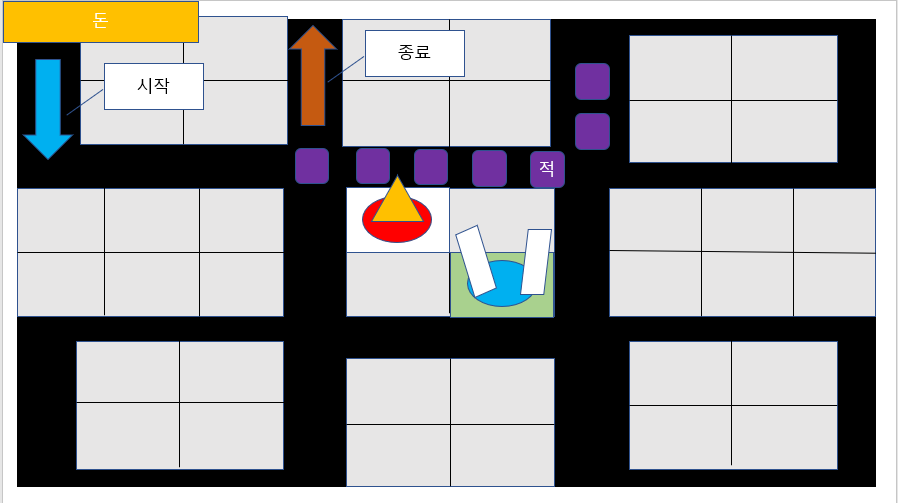

 

## 관련 이미지 & 동영상
- 이미지
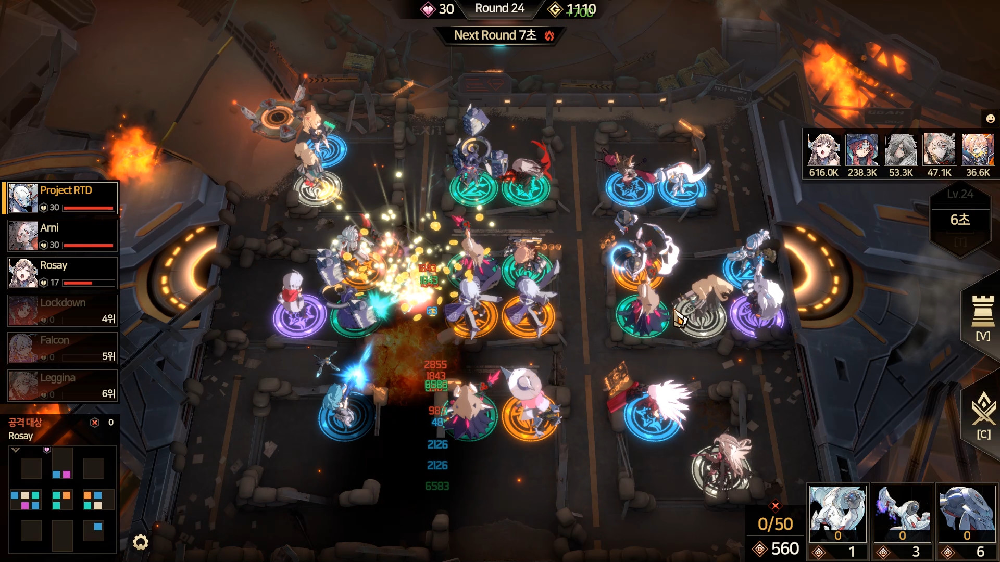
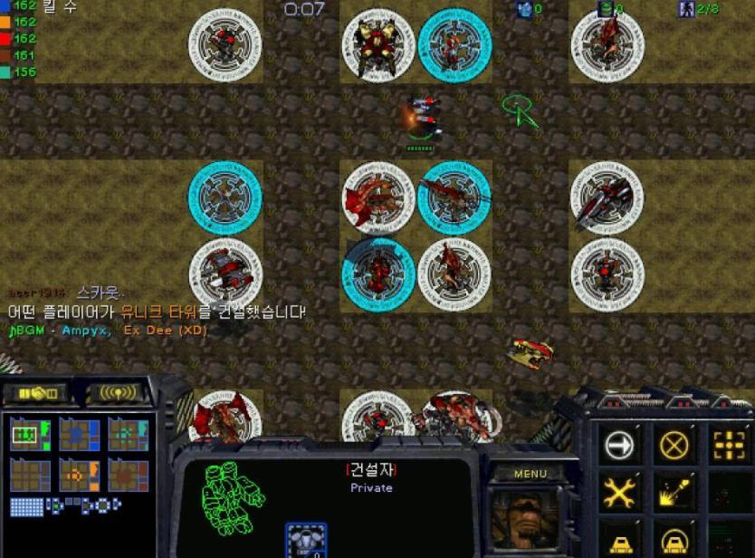

- 동영상

 

## 컨셉&대표이미지 기반 작품묘사
> ### 대표이미지 기반 : 시작지점에서 종료지점까지 일정한 길을 따라 이동하는 적들을 적합하고, 효율적인 위치에 타워를 설치하여 종료지점에 가지 못하도록 막는 것이 목표.

> ### 컨셉 기반 : 랜덤으로 나오는 타워들을 이용하여 적을 처치하고, 제한된 자원을 효율적으로 이용하여 오랜 시간을 버티는 것이 목표.

 

# [랜덤 디펜스] 구성 요소

## 매커니즘
[도전과제]
- 일정한 루트를 따라 이동하는 적들을 막아라
- 적들이 도착지점에 도착하기 전에 모두 없애라  

[재미요소]
- 주기적으로 높은 체력을 가진 한 마리의 보스 몬스터가 등장합니다.
- 언제든지 도전과제로 체력이 높은 보스몬스터를 생성할 수 있습니다. 이 몬스터를 처치에 성공할 경우 많은 자원을 주는 대신, 처치하지 못할 경우 많은 양의 목숨을 잃게 됩니다.
- 적을 처치시 일정 확률로 모든 몬스터에게 강력한 데미지를 주는 스킬이 발동합니다.

## 이야기
>이곳은 인류에게 남은 몇 안되는 최후의 방어선입니다. 총사령관은 대량의 좀비 무리가 이곳을 향해 다가오고 있다는 것을 알았고 생존자들을 지키기 위해 당신을 보냈습니다. 적절한 곳에 타워를 배치하여 몰려오는 공세를 막아내세요.

[참신함]
- 노련한 군인이었으나 지휘관으로서의 역량은 적었던 당신이었에 부대 배치에 관하여 많은 것이 모자랐습니다.
- 생성하는 타워는 랜덤하게 나오게 됩니다.

## 미적요소

[디자인]
- 좀비들과 보스 몬스터의 디자인이 있으며 좀비에 대한 거부감이 있는 사람들까지 플레이를 해볼 수 있도록 괴리감을 줄일 것입니다.
- 예시로, 평범한 사람 모델링을 베이스로 피를 살짝 묻히는 등의 것이 있습니다.

[사운드]
- 전장의 총소리는 긴박감을 더해줍니다.
- 타워들의 총과 대포소리, 보스몬스터가 나오기 전의 기괴한 소리를 내게 하여 플레이어에게 전투의 긴박감과 보스에 대한 대비를 더욱 굳건하게 하게 할 것입니다.

  

# Game System Disign

## 1. 게임 오브젝트 분해 [구성 요소 분석]

|연변|오브젝트 이름|오브젝트 이미지|
|:---:|:---:|:---:|
|1|타워(A-Type)|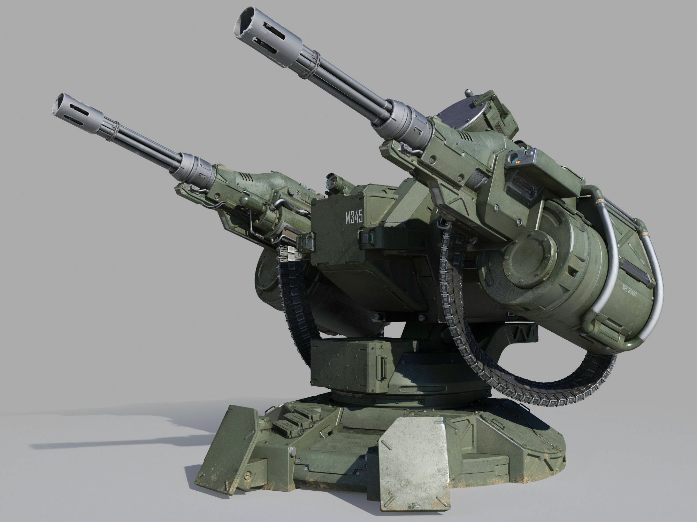|
|2|타워(B-Type)|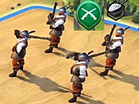|
|3|타워(C-Type)|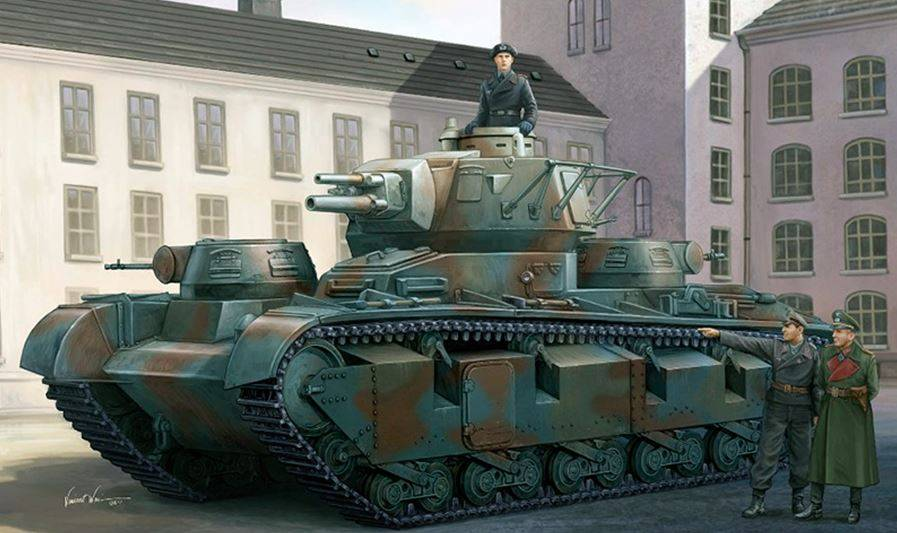|
|4|통상 적|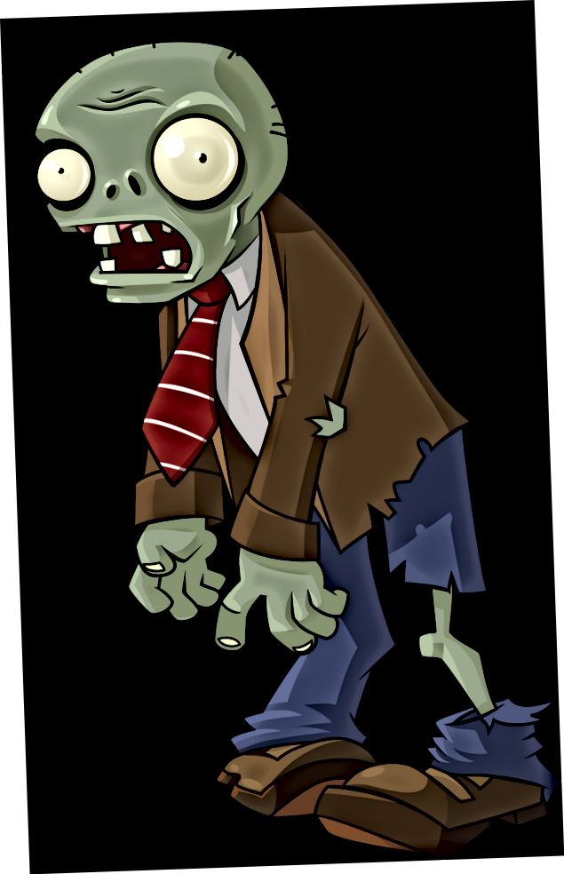|
|5|보스 몬스터|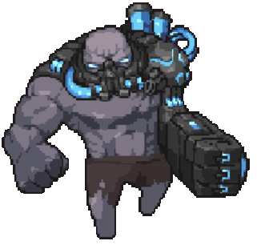|

  

## 2. 파라미터[속성] 뽑아보기

### - 오브젝트 이름:타워(A-Type)

|속성|속성값|설명|비고|
|:---:|:---:|:---:|:---:|
|데미지|Damage 100+Tier(Tier + 100, 5 Tier = 500 // Max 1500 Total 5Tier = 1600(100 + 1500)|적에게 주는 데미지|Upgrade (1Upgrade=Damage*15%)|
|공격범위|12*12   1타워=2x2//길 1x2//2x1|공격을 할 수 있는 범위||
|공격속도|1.5s (1=1Second)|타워 하나가 공격하는 속도|Upgrade (1Upgrade=0.05s//Max=0.5|
|공격타수|1|타워 하나가 공격 가능한 타수||
|타워 철거 비용|1Tier=50   2Tier=100   3Tier=200   4Tier=400   5Tier=800|타워를 철거(회수)할 때 얻는 비용||

 
 
### - 오브젝트 이름:타워(B-Type)

|속성|속성값|설명|비고|
|:---:|:---:|:---:|:---:|
|데미지|Damage 25+Tier(Tier + 15.5, 5 Tier = 75 // Max 225 Total 5Tier = 250(25 + 225)|적에게 주는 데미지|Upgrade (1Upgrade=Damage*10%)|
|공격범위|10*10   1타워=2x2//길 1x2//2x1|공격을 할 수 있는 범위||
|공격속도|1.0s (1=1Second)|타워 하나가 공격하는 속도|Upgrade (1Upgrade=0.03s//Max=0.3|
|공격타수|5|타워 하나가 공격 가능한 타수||
|타워 철거 비용|1Tier=50   2Tier=100   3Tier=200   4Tier=400   5Tier=800|타워를 철거(회수)할 때 얻는 비용||

 

### - 오브젝트 이름:타워(C-Type)

|속성|속성값|설명|비고|
|:---:|:---:|:---:|:---:|
|데미지|Damage 500+Tier(Tier + 200, 5 Tier = 1000 // Max 3000 Total 5Tier = 3500(500 + 3000)|적에게 주는 데미지|Upgrade (1Upgrade=Damage*20%)|
|공격범위|18*18   1타워=2x2//길 1x2//2x1|공격을 할 수 있는 범위||
|공격속도|3.0s (1=1Second)|타워 하나가 공격하는 속도|Upgrade (1Upgrade=0.07s//Max=0.7|
|공격타수|1|타워 하나가 공격 가능한 타수||
|타워 철거 비용|1Tier=50   2Tier=100   3Tier=200   4Tier=400   5Tier=800|타워를 철거(회수)할 때 얻는 비용||

 

### - 오브젝트 이름:통상 적

|속성|속성값|설명|비고|
|:---:|:---:|:---:|:---:|
|체력|Normal Hp : 500   Hard Hp : 1000|몬스터의 체력|Round 10까지:HP+50%   Round11~50:Hp+20%   Hard:Hp+20%|
|이동속도|2.0(/1s)-1초에 이동하는 거리|몬스터가 이동하는 속도||
|처치시 주는 자원|10|몬스터를 처치시 획득하는 자원의 양||
|적의 숫자|10|한 번의 웨이브(라운드)에서 나오는 적의 숫자|10의 n배수 웨이브에서는 등장하지 않음.|
|웨이브 종료시 추가 자원|100|웨이브가 끝난 이후 주는 자원||

 

### - 오브젝트 이름:보스 몬스터

|속성|속성값|설명|비고|
|:---:|:---:|:---:|:---:|
|체력|Normal Hp : 10000   Hard Hp : 15000|몬스터의 체력|Normal Hp+300%   Hard Hp+300%|
|이동속도|4.0(/1s)-1초에 이동하는 거리|몬스터가 이동하는 속도||
|처치시 주는 자원|200|몬스터를 처치시 획득하는 자원의 양||
|적의 숫자|1|한 번의 웨이브(라운드)에서 나오는 적의 숫자|10의 n배수 웨이브마다 등장|
|웨이브 종료시 추가 자원|100|웨이브가 끝난 이후 주는 자원||

 

### - 오브젝트 이름:플레이어

|속성|속성값|설명|비고|
|:---:|:---:|:---:|:---:|
|타워 건설|(A-Type, B-Type, C-Type)→Ramdom|타워 건설 시 랜덤한 타입의 타워 생성.|33%확률로 A,B,C 자원 소모|
|자원|0+n|플레이어가 갖고 있는 자원|웨이브 처치, 웨이브 종료, 보스 제거, 선택 보스 클리어 시 획득|
|위신|Classic, Type1, Type2, Type3|플레이어가 선택한 게임의 스타일 정의||
|타워 업그레이드|Upgrade→(A,B,C)Type Select|선택한 타입의 타워 업그레이드|A,B,C타입 선택 상화, 자원 소모|
|선택보스생성|Level 1,2,3,4,5|지정하여 보스 생성.|개별 쿨타임 4분.|
|목숨|20|플레이어가 갖고 시작하는 목숨, 적이 도착지점에 도착하면 목숨이 -1개씩 차감됨.|획득 방법 없음.|

## 3. 행동양식

### - 오브젝트 이름: 타워(A,B,C)

|행동|설명|
|:---:|:---:|
|대기|적이 사정거리 이내에 없을 경우 대기함.|
|공격|적이 사정거리 이내에 있을 경우 공격함.|
|회전|공격하려는 적을 향해 포대나 총구의 방향이 회전함.|

### - 오브젝트 이름: 적

|행동|설명|
|:---:|:---:|
|이동|생성시 경로를 지어하여 경로에 따라 골인지점으로 이동함.|
|회전|길을 따라 걸으며 회전을 하며 방향이 이동됨.|
|도착|적이 목표지점에 도착할 경우.|
|사망|적의 Hp가 0이 된 경우 사망함.|

  

## 4. 상태 뽑아 보기

### - 오브젝트 이름: 타워

|현상태|전이상태|전이조건|
|:---:|:---:|:---:|
|대기 상태|공격 상태|사정거리 이내에 적이 나타날 경우.|
|공격 상태|대기 상태|적이 사정거리 바깥으로 가거나, 죽은 경우.|
|공격 상태|회전 상태|적이 직선상에 존재하지 않는 경우.|

### - 오브젝트 이름: 적

|현상태|전이상태|전이조건|
|:---:|:---:|:---:|
|이동 상태|사망 상태|Hp가 0이 되었을 경우.|
|이동 상태|회전 상태|적이 방향을 꺾는 경우.|
|회전 상태|이동 상태|적이 방향을 꺾은 후 이동할 경우|
|이동 상태|도착 상태|적이 목표지점에 도착한 경우|

## 5. 플레이어 캐릭터 속성(파라미터)

|속성|영문명칭|설명|비고|
|:---:|:---:|:---:|:---:|
|데미지|Damage|타워가 적에게 주는 데미지, 티어를 올릴 때 마다, 업그레이드 단계를 올릴 때 마다 강화된다.   자세한 것은 2번 파라미터 뽑아보기 참조|업그레이드 타입별 증강치 다름|
|공격범위|Range|타워가 공격을 할 수 있는 범위||
|공격속도|Attackspeed|타워가 공격하는 속도. 자세한 것은 2번 파라미터 뽑아보기 참조|업그레이드 타입별 증감치 다름|
|티어|Tier|티어는 최대 5티어까지 존재하며, 티어를 올릴 수록 공격력과 공격 속도가 상승한다.||
|업그레이드|Upgrade|업그레이드는 티어와는 별개로 적용되며, 포탑의 타입(A,B,C)별로 업그레이드가 적용된다.   최대 10단계까지 존재하며, 업그레이드 단계를 올릴 수록 공격력과 공격 속도가 상승한다.||
|자원|Gold|적을 처치하거나 웨이브(라운드)가 종료될 시 얻는 자원|보스몬스터와 일반몬스터 처치시 자원량이 다름|

## 6. 게임의 규칙

### 1) 핵심 규칙

1. 타워는 랜덤한 타입으로 만들어진다.
2. 적은 정해진 길을 따라 목표지점까지 움직인다. 적들이 도착하기 전에 모두 없애라.
3. 한정된 자원을 효율적으로 운용해 적들로부터 오래 살아남는 것이 목표.

### 2) 보조 규칙

1. 같은 타입의 타워를 조합하여 상위 티어의 타워를 랜덤으로 만들 수 있다.
2. 적을 처치하거나, 웨이브가 끝난 경우 자원을 얻는다.
3. 주기적으로 높은 체력을 가진 보스 몬스터가 나온다.
4. 주기적으로 등장하는 보스몬스터 외에 언제든지 따로 보스몬스터를 소환하여 도전이 가능하다.  
처치에 성공한 경우 많은 자원을 얻지만, 처치에 실패하여 도착 지점까지 도달했을 경우 많은 양의 목숨을 잃는다.
5. 웨이브 도중에도 타워의 건설, 합성, 업그레이드 가능하다.

 

## 7. 게임에서 사용될 공식

### 1)

1. 타워의 공격력과 적의 HP를 구한다.
2. 공격력이 HP보다 크면 적은 사라진다.
3. 타워는 다른 타깃을 찾기 위해 회전상태로 전환한다.
4. 범위 이내에 다른 타깃이 없을 경우 대기상태로 전환한다.

### 2)

1. 적의 위치 - 적의 남은 체력을 계산한다.
2. 적의 HP가 1보다 크고, 목표지점에 도달한 상태일 경우
3. 적을 삭제하고 도착상태로 전환하며 플레이어의 목숨을 1개(보스일경우 5개)만큼 삭제한다.

  

# 개발 요구사항 및 흐름도

 

## 요구사항(6Week)

 

## 요구사항(1Year)

- 시작화면, 위신 선택 화면, 게임 화면, 점수화면 4가지가 있다.
- 시작화면에는 게임하기와 위신 선택하기, 점수보기라는 버튼이 3개가 있다.
- 점수보기 클릭 시 최단기록을 보여준다.
- 상단부터 게임 빨리 클리어한 순으로 5개의 리스트를 보여준다.
- 점수보기에는 돌아가기 버튼이 있고 클릭 시 시작화면으로 이동한다.
- 시작화면에서 위신 선택을 클릭하면 위신 선택 화면으로 이동한다.
- 위신 선택 화면에서는 4개의 버튼이 있고 클릭시 우측에 선택한 것에 대한 설명이 나온다.
- 위신 선택 화면에서 내가 원하는 것을 클릭하고 세이브 하면 게임 플레이시 위신이 적용되어 게임을 시작한다.
- 위신 선택 화면에는 돌아가기 버튼이 있고 클릭시 시작화면으로 이동한다.
- 시작화면에서 게임 시작 버튼을 누를 경우, 두 가지 버튼이 나오게 한다. Normal 난이도와 Hard난이도 선택 버튼이 나온다. 버튼을 클릭 시, 게임 화면으로 이동한다.
- 게임화면의 중간에는 18x18 사이즈의 정사각형 맵이 나온다.
- 게임화면 좌측 상단에는 현재 갖고 있는 자원과 남은 목숨 20개가 표기된다.
- 게임화면 중앙 상단에는 현재 라운드(웨이브)와 다음 웨이브까지 필요한 시간을 알려주는 창이 있다.
- 게임화면 우측 하단에는 타워 업그레이드 버튼과 선택 보스 생성 버튼이 있다.
- 게임 시작 1분 후 정해진 위치에서 적들이 나타난다. 적들은 정해진 길로 이동하며 라운드를 진행할 때마다 체력이 늘어난다.
- 적들을 처치하면 10의 자원을, 웨이브를 막던, 막는 데 실패하던 웨이브가 끝난 이후에는 100의 자원을 얻는다. 보스몬스터를 처치하면 400의 자원을 추가로 얻는다.
- 10의 n배수 라운드마다 높은 체력과 빠른 이동속도를 지닌 보스몬스터가 나타난다.
- 이동하는 적을 클릭 시 적 유닛의 정보를 표기하는 ui가 화면 왼쪽에 표시된다.
- 타워 건설이 가능한 맨 땅을 클릭시 우측에 타워 건설 버튼이 나온다.
- 타워를 건설할 경우 랜덤한 타입의 타워 한 개가 생성된다.
- 타워를 클릭 시 타워의 정보를 표기하는 UI가 우측 상단에 나타난다.
- 타워의 업그레이드는 50의 자원이 소모되며 업그레이드를 할 때마다 10의 자원을 추가로 요구한다.
- 동일한 타입, 티어의 타워가 둘 이상 있을 경우, 타워를 클릭 시 타워 정보 ui에 합성 버튼이 나타난다.
- 타워를 합성 시 선택한 타워와 랜덤한 위치에 있는 동일한 타워 한 개를 제거하고 선택한 타워가 있는 곳에 보다 높은 티어의 타워 한 개를 랜덤으로 생성한다.
- 타워는 범위 이내의 적을 랜덤하게 타깃하여 공격한다.
- 선택 보스 생성 버튼을 클릭 시 5개의 리스트를 보여준다. Level 1부터 5까지. 1의 체력은 30000, 2는 75000, 3은 125000, 4는 250000, 5는 500000. 1을 클리어할 경우 100의 자원을, 2는 200, 3은 300, 4는 400, 5는 500의 자원을 준다.
- 적이 목표지점에 도달한 경우 목숨을 1개만큼 깎는다. 보스몬스터가 목표지점에 도달한 경우 목숨을 5개만큼 깎는다.
- 목숨이 0개일 경우 게임에서 패배하게 된다.
- 게임의 종료 조건은 50웨이브 이후 목숨이 남아있는 경우 승리한다.
- 게임이 종료되면 종료 팝업이 뜬다. 팝업에는 현재까지 버틴 시간이 출력된다.
만약 하이스코어(1등)일 경우 스코어가 갱신됨을 보여준다.

## 시간별 흐름도 FlowChart

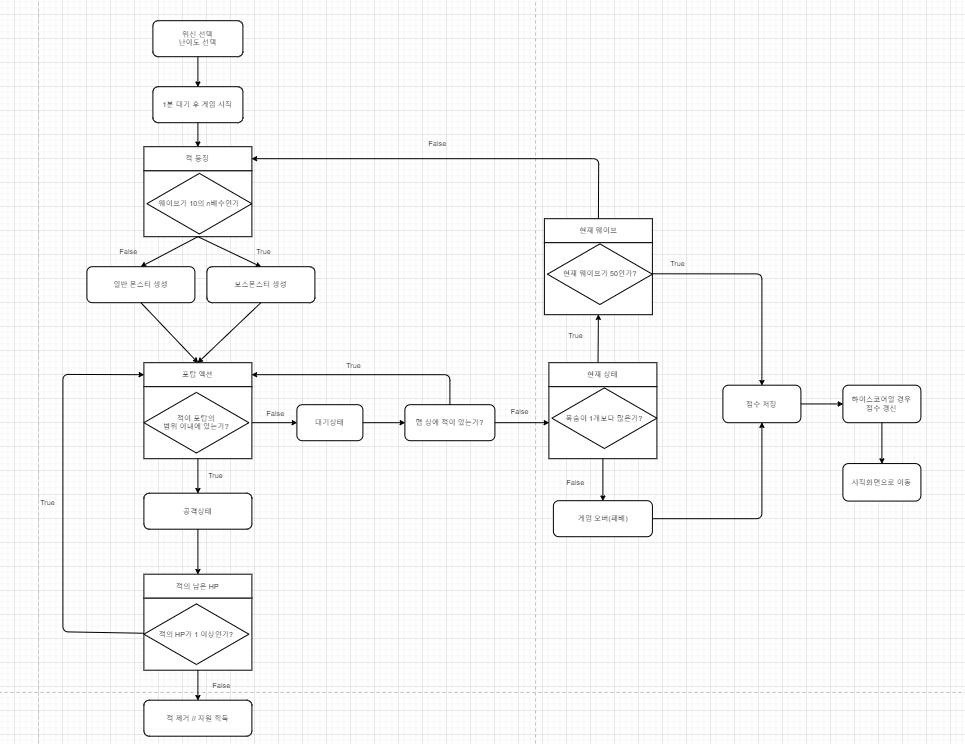
 

## 마우스 이벤트에 대한 흐름도

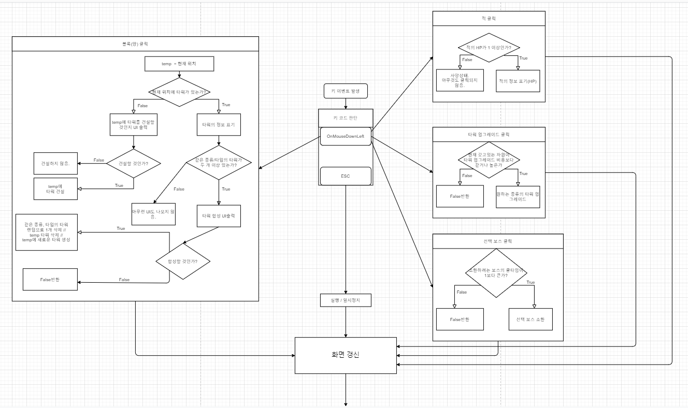
 

## 용어 정리
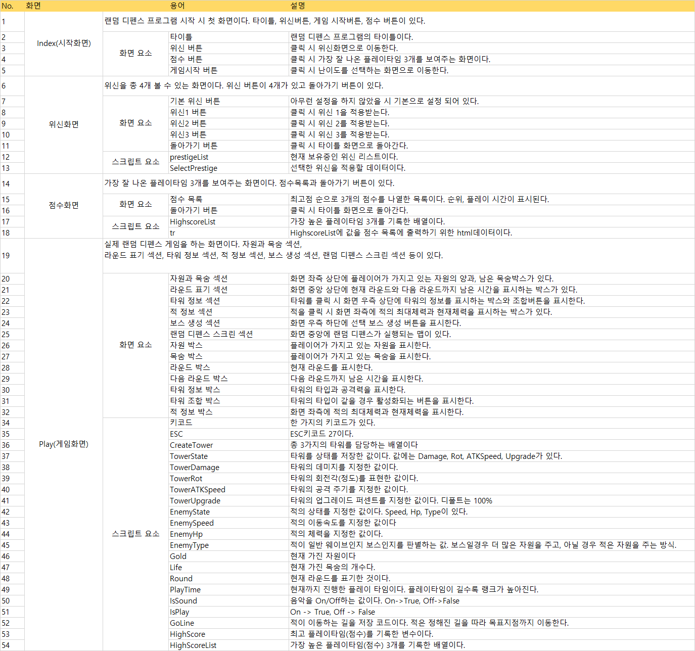
 

## 개발작업 일정
